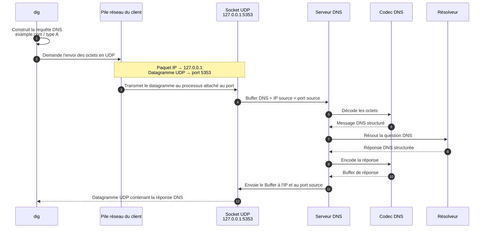
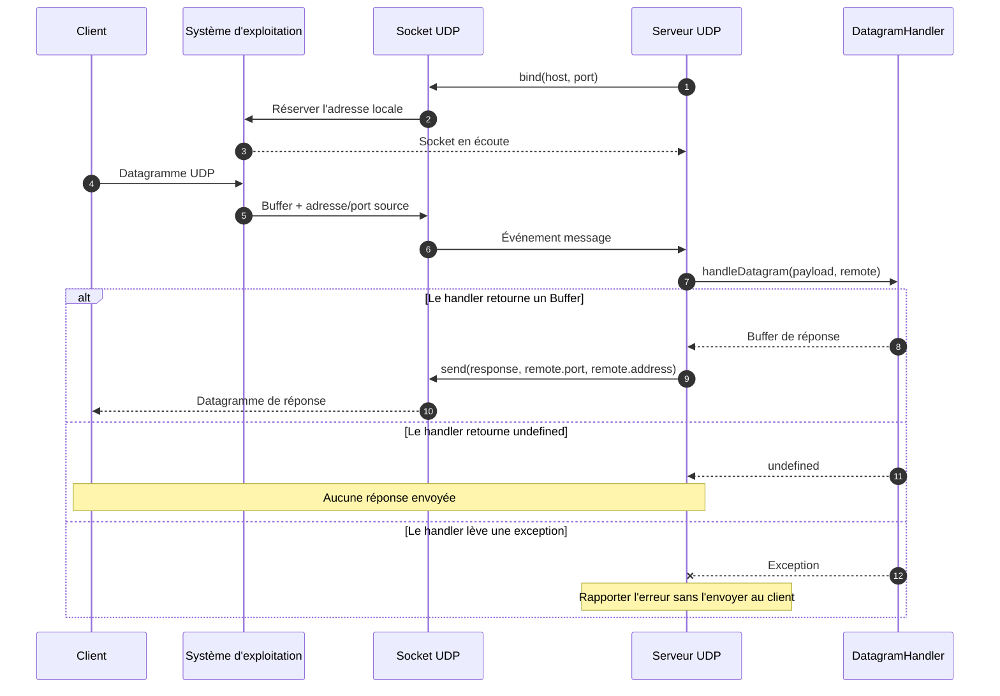

Voici la conception du projet.

## Architecture en plusieurs couches

- La couche CLI démarre et configure le serveur DNS. Elle ne reçoit pas et ne parse pas les requêtes.
- La couche serveur ouvre une socket UDP, reçoit les paquets sous forme d'octets et envoie les réponses.
- Le codec DNS décode les octets reçus en un message DNS exploitable, puis encode la réponse en octets.
- La couche de résolution détermine la réponse à apporter à la question DNS.
- La couche de cache conserve temporairement les réponses selon leur TTL.
- Le système de journalisation permet d'observer le traitement des requêtes.
- Un orchestrateur coordonne ces composants sans contenir leur logique métier.

## Parcours d'une requête avec `dig`



## Couche CLI

La CLI transforme les arguments fournis au processus en une configuration typée.
Elle ne connaît ni les sockets ni le format des messages DNS.

```text
process.argv
    ↓
parseArguments(args)
    ↓
CliResult
    ├── help  → afficher l'aide
    ├── error → afficher l'erreur et terminer avec le code 1
    └── start → transmettre ServerConfig au futur orchestrateur
```

La configuration de développement par défaut est volontairement locale :

```ts
{
  host: "127.0.0.1",
  port: 5353
}
```

Exemples :

```bash
npm run dev -- --help
npm run dev -- --host 127.0.0.1 --port 5353
```

## Couche serveur UDP

La couche serveur UDP transporte des datagrammes sans connaître leur format.
Elle ne sait donc pas encore ce qu'est une question ou une réponse DNS.

Son interface reçoit un handler qui forme la seam avec le futur orchestrateur :

```text
Datagramme UDP reçu
    ↓
{ payload: Buffer, remote: { address, port, family } }
    ↓
DatagramHandler
    ├── Buffer    → envoyer ces octets à remote
    ├── undefined → ne pas répondre
    └── exception → rapporter une erreur interne
```

Le module expose seulement son cycle de vie :

```ts
type UdpServer = {
  start(): Promise<BoundAddress>;
  close(): Promise<void>;
};
```

`start()` retourne l'adresse réellement réservée. Cela permet aux tests d'utiliser
le port `0`, qui demande au système d'exploitation de choisir un port disponible.
La CLI continue de refuser ce port, car il ne serait pas pratique pour un utilisateur
qui doit connaître l'adresse fixe de son serveur.



Le serveur UDP n'appelle directement ni le codec ni le résolveur. Le futur
orchestrateur fournira le `DatagramHandler` qui enchaînera ces couches.
